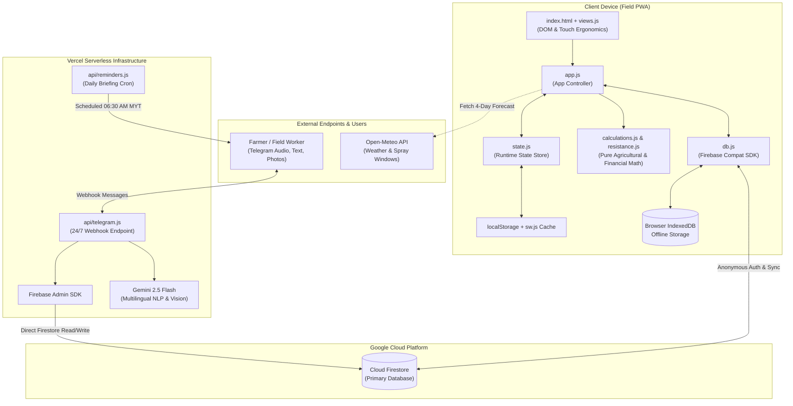

# 🌾 Kabun Farm Intelligence — System Architecture & Codebase Guide

This document provides a comprehensive technical overview of the **Kabun Farm Intelligence** system: its design philosophy, architectural components, data flows, folder structures, and key execution entry points.

---

## 1. Core Purpose & Stack

**Kabun Farm Intelligence** is an offline-first **Progressive Web App (PWA)** accompanied by a 24/7 Telegram AI assistant. It is purpose-engineered for logging and managing daily commercial vegetable farming operations in **Kudat, Sabah, Malaysia**.

The system is optimized for real-world tropical field environments:
- **Harsh Field Usability:** High-contrast palette for midday sunlight glare, $\ge 48\text{px}$ touch targets for wet/dirty hands, and slide-up bottom sheets for single-handed mobile reach.
- **Offline Reliability:** Zero cellular dependency for field logging; transparent local caching via IndexedDB and Service Worker.
- **Agricultural Decision Support:** Automated 3-way watering alarms, tropical crop maturity growth trackers, tank dilution calculators, and FRAC/IRAC chemical rotation guardrails.
- **Multilingual Voice & Vision AI:** Background Telegram webhook accepting voice notes, text, and leaf disease photos in Bahasa Melayu, Manglish, and Chinese.

### Technology Stack

| Layer | Technologies & Tools | Architectural Rationale |
| :--- | :--- | :--- |
| **Client Frontend** | Pure Vanilla JavaScript (ES6 Modules), HTML5, Vanilla CSS | **Zero build step, zero bundler overhead.** Eliminates build fragility and enables instant in-field debugging. |
| **Offline Storage & Caching** | Service Worker (`sw.js`), LocalStorage, IndexedDB (`enablePersistence`) | Guarantees instant sub-second UI rendering and offline write capability even during complete network dropouts. |
| **Remote Database** | Google Cloud Firestore (Compat SDK v10.14.0) | Multi-collection document database providing real-time data sync across devices and cloud backup. |
| **Authentication** | Firebase Anonymous Authentication (`signInAnonymously`) | Zero-friction user onboarding in the field while maintaining locked Firestore Security Rules (`request.auth != null`). |
| **Backend & Serverless** | Vercel Serverless Functions (Node.js ESM) | Powers high-availability Telegram webhooks, cron jobs, and Gemini multimodal AI without managing dedicated servers. |
| **AI & Pathology Vision** | `@google/generative-ai` (Gemini 2.5 Flash) | Real-time speech-to-intent parsing, structured entity extraction, and leaf pathogen visual diagnosis. |
| **Testing & Verification** | Playwright (`@playwright/test`) & Zero-Dependency `test.html` | Comprehensive 101-assertion regression test suite validating agricultural math, date arithmetic, and DOM components. |

---

## 2. Directory & File Breakdown

```
KabunFarm/
├── api/                             # Vercel Serverless Microservices & Crons
│   ├── reminders.js                 # Daily morning briefing cron handler (06:30 AM MYT / 22:30 UTC)
│   ├── set-webhook.js               # Protected administrative endpoint to bind Telegram webhook URL
│   └── telegram.js                  # Production webhook: Gemini AI NLP, Vision & Firebase Admin SDK
├── bot/                             # Standalone Local Bot Runner
│   ├── bot.js                       # Polling-based Telegram bot daemon for local development/debugging
│   ├── package.json                 # Bot runner dependencies (node-telegram-bot-api, dotenv)
│   └── .env                         # Local bot environment variables (ignored by git)
├── e2e/                             # Automated Browser Testing
│   └── test_suite.spec.js           # Playwright runner executing test.html and DOM interaction tests
├── js/                              # Modular Client Application Logic (ES Modules)
│   ├── app.js                       # Main UI controller, modal lifecycle, and window bridge bindings
│   ├── calculations.js              # Pure agricultural math (watering engine, dilution, P&L, growth stages)
│   ├── db.js                        # Firestore persistence layer, anonymous auth handshake, offline sync
│   ├── resistance.js                # FRAC/IRAC mode-of-action registry, chemical dosages & PHI intervals
│   ├── state.js                     # Central in-memory state store, constants, date utils & color maps
│   └── views.js                     # Dynamic DOM renderers (grid, list, momentum pulse, modal drawers)
├── scripts/                         # Locally Bundled Vendor Libraries (Zero-CDN Dependency)
│   ├── firebase-app-compat.js       # Firebase App Core SDK v10.14.0
│   ├── firebase-auth-compat.js      # Firebase Auth SDK (Anonymous Authentication)
│   └── firebase-firestore-compat.js # Firebase Firestore SDK (Offline IndexedDB Persistence)
├── .agents/                         # Custom Agent Rules & Architectural Directives
│   └── rules/architect.md           # Engineering guidelines, review format, and deployment protocols
├── index.html                       # Application shell, bottom sheets, SVG icons, and vendor script tags
├── style.css                        # Mobile-first CSS design system, typography tokens, and GPU animations
├── sw.js                            # Cache-first Service Worker for local application assets
├── test.html                        # Zero-dependency browser regression test suite (101 automated checks)
├── netlify.toml                     # Netlify static hosting deployment config (publish: ".")
├── vercel.json                      # Vercel serverless headers and scheduled cron triggers
├── package.json                     # Root project configuration and test scripts
├── playwright.config.js             # Playwright browser runner configuration
└── manifest.json                    # PWA installation manifest (standalone mobile display)
```

---

## 3. Architecture & System Data Flow



---

## 4. State Management & Data Persistence

### Dual-Layer Storage Model
1. **Immediate Local Cache (`localStorage`):**
   - Keys: `farmlog_beds_cache`, `farmlog_formulas_cache`, `farmlog_logs_cache`, `farmlog_sales_cache`, `farmlog_tasks_cache`, `farmlog_plots_cache`, `farmlog_inventory_v1`, `farmlog_expenses_v1`.
   - Populates the reactive `state` object synchronously upon initial page load, preventing visual layout shifts or blank screens before network responses arrive.
2. **Robust Offline Queue (IndexedDB):**
   - Handled transparently by `firebase.firestore().enablePersistence({ synchronizeTabs: true })`.
   - Reads/writes succeed immediately while offline; transactions are queued locally and automatically committed to Cloud Firestore once internet connectivity resumes.

### Core Business Logic Subsystems
- **3-Way Watering Resolution Engine:**
  Evaluates watering status by cross-referencing individual bed logs, plot-level bulk logs, and whole-farm irrigation events. Automatically flags beds unwatered for $\ge 3\text{ days}$ while intentionally excluding fallow (`💤 Fallow`) and empty-crop beds.
- **Biological Growth Stage Tracker:**
  Calculates days elapsed since planting against tropical crop growth benchmarks (e.g., Kangkong 25d, Bayam Merah 45d, Terung 70d) to render visual stage progress bars (`🌱 Sprout` $\to$ `🌿 Vegetative` $\to$ `🌸 Flowering/Fruiting` $\to$ `🧺 Harvest Ready`).
- **Dynamic Sprayer Tank Scaling:**
  Parses ingredient ratios (`name:amount:unit`) and dynamically scales dosages from 16L knapsack sprayers up to 1,000L IBC tanks with instant input cost allocation.

---

## 5. Key Entry Points & Bootstrapping Sequence

### 1. PWA Client Application (`index.html`)
- **Boot Sequence:**
  1. Service Worker registration (`sw.js`) begins in the background.
  2. Local vendor compat libraries load sequentially (`firebase-app-compat.js`, `firebase-auth-compat.js`, `firebase-firestore-compat.js`).
  3. `js/app.js` is imported as an ES6 module.
  4. On `DOMContentLoaded`, `initApp()` executes:
     - Sets up pull-to-refresh and network status listeners (`online`/`offline`).
     - Awaits `waitForAuth()` (negotiates anonymous Firebase token).
     - Fetches plots, beds, formulas, weather, and tasks.
     - Sets active view (defaults to `home`) and renders all dynamic DOM nodes.

### 2. Production Telegram Webhook (`api/telegram.js`)
- **Handler:** `export default async function handler(req, res)` (Vercel Serverless Function).
- **Execution:**
  1. Validates `X-Telegram-Bot-Api-Secret-Token` header.
  2. Verifies sender against `ALLOWED_CHAT_IDS` whitelist.
  3. Processes voice audio / text notes via Gemini Flash to produce structured JSON payloads.
  4. Persists records to Cloud Firestore using `firebase-admin`.

### 3. Automated Morning Briefing (`api/reminders.js`)
- **Handler:** Vercel Cron trigger configured in `vercel.json` (`schedule: "30 22 * * *"` $\implies$ 06:30 AM MYT).
- **Execution:** Synthesizes weather alerts, unwatered beds, and pending tasks into a formatted morning message dispatched via Telegram Bot API.

### 4. Regression & Verification Harness (`test.html`)
- **Execution:** Self-contained browser harness containing 101 automated assertions.
- **Headless Execution:** Run via `npm test` (`playwright test`), verifying core agricultural math, timestamp transformations, recipe scalers, and DOM interactions in Chromium.

---

## 6. Operational & Deployment Protocols

1. **Zero-Build Deployments:**
   - The application does not require compile or build steps.
   - Deployments to Netlify publish the repository root directly (`publish = "."`).
2. **Cache Busting Strategy:**
   - On release of client modifications, increment the cache-buster query parameter in `index.html` (e.g. `<script type="module" src="js/app.js?v=YYYYMMDDx">`) and update `CACHE_NAME` in `sw.js`.
3. **Pre-Release Verification:**
   - All tests in `test.html` must pass (`npm test`) before pushing updates to production branches.
